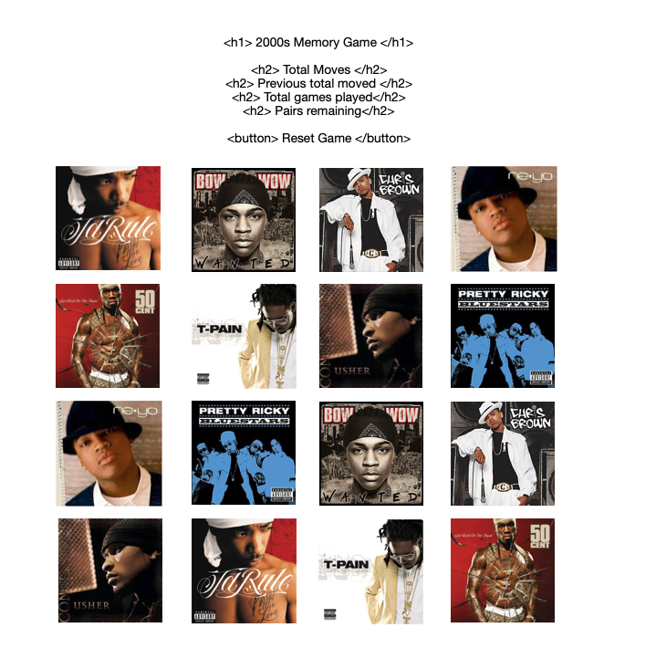
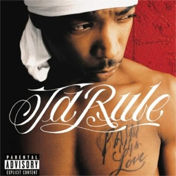
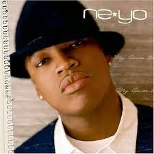
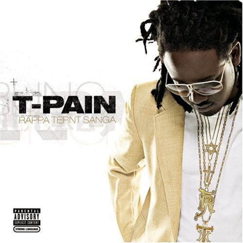
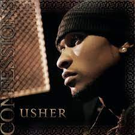

# Memory Game (2000s remix)

## Background 

- Game Choice: Memory Game 
    I decided to create a 2000s version memory game and implent some of my favorite albums from that era. 

## Wireframe

 
 (https://upload.wikimedia.org/wikipedia/en/9/9d/Get_Rich_Or_Die_Tryin%27.JPG)

 (https://upload.wikimedia.org/wikipedia/en/2/22/Wanted_album_cover.jpg)

 (https://upload.wikimedia.org/wikipedia/en/thumb/c/ce/Chris_brown.jpg/220px-Chris_brown.jpg)

 (https://upload.wikimedia.org/wikipedia/en/b/b1/Ja-rule-pain-is-love.jpg)

 (https://upload.wikimedia.org/wikipedia/en/thumb/9/9a/In_my_own_words_Ne-Yo.jpg/220px-In_my_own_words_Ne-Yo.jpg)

 (https://upload.wikimedia.org/wikipedia/en/f/fc/Bluestars_%28Pretty_Ricky_album%29.jpg)

 (https://upload.wikimedia.org/wikipedia/en/d/d3/T-Pain_-_Rappa_Ternt_Sanga.jpg)

 (https://upload.wikimedia.org/wikipedia/en/7/74/Usher_-_Confessions_album_cover.jpg)

### PseudoCode

    Style: 
        - title
        - total moves
        - total games played
        = pairs remaining 
        - reset button
        - 4 x 4 grid 
        - downloadable playlist to listen to while playing

    Data:
        - total moves 
        - total games played 
        - pairs remaining
        
    Functionality: 
        - card flips when clicked 
        - card stays flipped until second card is clicked 
        - flip back if not a match else stays facing forward
        - reset button resets entire board (facing downward)
        - reset button resets total moves and pairs remaining 

